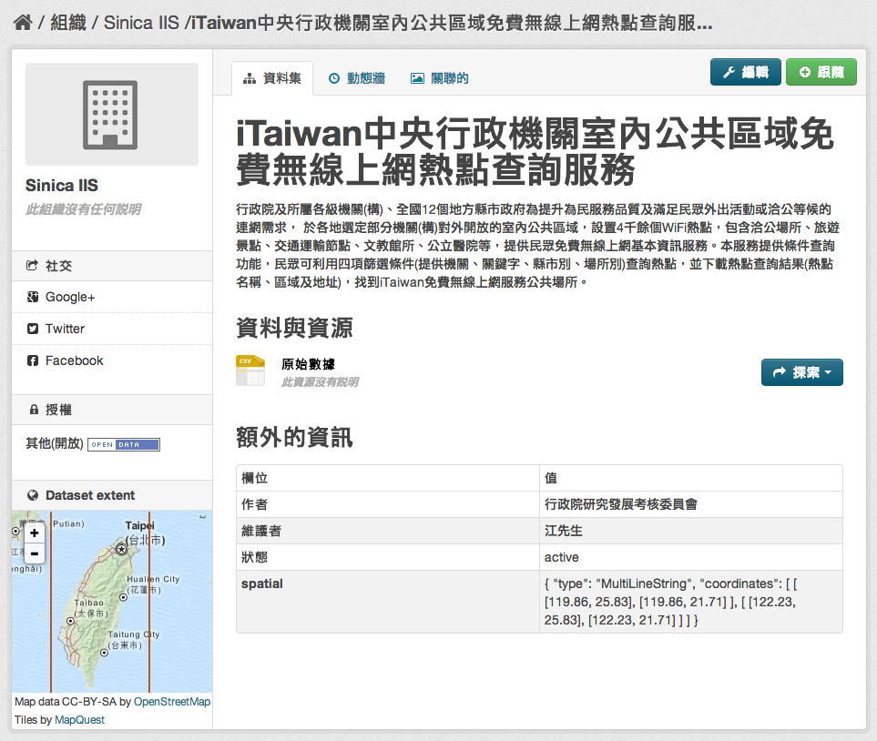
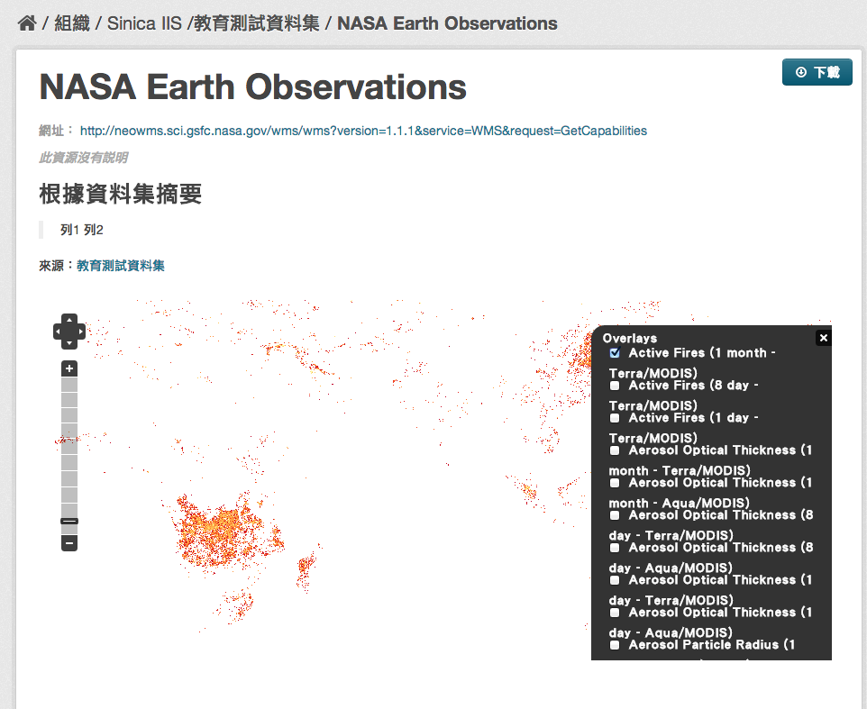

ckanext-spatial
================

ckanext-spatial 是一个 ckan 的扩展 (extension)，提供地理信息相关功能。

详细介绍可以参考 `ckanext-spatial 的官方 github <https://github.com/okfn/ckanext-spatial>`_ 。

外挂主要功能简介                                                                                                               
-----------------                                                                                                              
                                                                                                                               
spatial_metadata                                                                                                               
^^^^^^^^^^^^^^^^^^                                                                                                             
建立地理空间信息之索引。                                                                                                       
                                                                                                                               
Spatial Search Widget                                                                                                          
^^^^^^^^^^^^^^^^^^^^^^                                                                                                         
按地图搜索数据集 "spatial" 栏位的地理空间信息，仅支援 solr 3.1+。安装完成后，即可在数据集清单显示页面的左下角看到 "Filter by location" 的区块，此区块并可放大后，依照使用者选取的地理区域筛选出符合的数据集。
                                                                                                                               
欲使用此功能，请在 ckan.plugins 加入 spatial_metadata 与 spatial_query。                                                       
                                                                                                                  
Dataset Extent Map                                                                                                             
^^^^^^^^^^^^^^^^^^^                                                                                                            
以地图显示数据集 "spatial" 栏位所述之地理空间信息 (仅支援 geojson 格式)。如下图所示，在“额外的信息”中填写的 spatial geojson 信息，将显示在左下角的 Dataset extent 中。

欲使用此功能，请在 ckan.plugins 加入 spatial_metadata。                                                                        
                                                                                                                               

WMS Preview                                                                                                                    
^^^^^^^^^^^^                                                                                                                   
此功能可以地图方式呈现 wms 服务所涵括的地理范围 (GetCapabilities)，并可切换图层。

欲使用此功能，请在 ckan.plugins 加入 wms_preview。                                                                             
                                                                                                                               
以 `NASA Earth Observations <http://neowms.sci.gsfc.nasa.gov/wms/wms?version=1.1.1&service=WMS&request=GetCapabilities>`_ 为例：                                                                                                                             
                                                                                                                               

                                                                                                                               
GeoJSON Preview                                                                                                                
^^^^^^^^^^^^^^^^^                                                                                                              
以地图检视 GeoJSON 文件（ckan 内建之 preview 仅支援以树状结构显示 json 格式文件）。支援 ``geojson`` 与 ``gjosn`` 两种文件格式名称定义。                                                                                                                               
欲使用此功能，请在 ckan.plugins 加入 geojson_preview 与 resource_proxy。                                                       
                                                                                                                               
CSW Server                                                                                                                     
^^^^^^^^^^^                                                                                                                    
提供 CSW 服务介面。                                                                                                  
                                                                                                                               
.. _spatial-harvesters:                                                                                                        

Spatial Harvesters                                                                                                             
^^^^^^^^^^^^^^^^^^^                                                                                                            
提供地理空间相关的 harvesters，可以将 CSW, WAF, spatial metadata document 等数据目录来源的后设数据撷取下来并导入 ckan 之中。须注意的是，数据本身仍然位于原数据目录之网站。此 harvester 系实作 ckanext-harvest 组件之 harvester interface。

欲使用此功能，请安装 `ckanext-harvest 外挂 <https://github.com/okfn/ckanext-harvest>`_ 并在 ckan.plugins 加入 csw_harvester, doc_harvester 与 waf_harvester。

.. note::

   * 若您有成功安装 ckanext-spatial 组件并启用上述三个 plugins，应该可以看到 "CKAN, CSW Server, Web Accessible Folder (WAF), Single spatial metadata document" 四种 source 类别

   * ckanext-spatial 提供的 havester 现阶段 (0.2) 并不稳定，导入大量数据很缓慢（实测 11,400 笔左右需时 3 小时），且容易因 source 缺少某些栏位值或 source 数据格式与 harvester（及其相依的 python library）不符而引发 python exception。

   * 实测结果，CSW 可能会有问题（见下方说明）、WAF 可以运作（但数据需符合 ISO 19139 规范）。

其使用方式与一般 ckan harvester 相同，请参考 :doc:`ckanext-harvest`

* TGOS（国土信息图资服务平台）CSW source harvesting 经验：

  尝试将 TGOS 提供之 `CSW 服务 <http://tgos.nat.gov.tw/tgos/Web/TGOS_Home.aspx>`_ ，透过 spatial harvester 导入 ckan，结果会发生 list out of range exception。

  原因是 spatial harvester 使用的 `OWSLib <http://geopython.github.io/OWSLib/>`_ 这个 python library 判断 csw source 的 xml tag ``gmd:identificationInfo`` 时，认定其下只有一个子 tag ``MD_DataIdentification`` ， 但 TGOS 有部份的数据却有两个 ``MD_DataIdentification`` （ `如此例 <http://tgos.nat.gov.tw/tgos/Web/Metadata/TGOS_MetaData_View.aspx?MID=4229&SHOW_BACK_BUTTON=false&keyword=TW-09-371020000A-000001>`_ ） ，因此造成 python 错误。 

  原先怀疑是 TGOS 不符合 ISO19139 规范，但基本上 ISO 应无要求 tag 的数量只能有一个。

  所以 TGOS 导入 CSW 失败，既不是 ckanext-spatial 组件本身的问题，也不是 TGOS csw 不符合 ISO19139 规范，其实是 OWSLib 的问题。此问题可以借由简单修改 OWSLib 原始码解决。

  打开 ``/usr/lib/ckan/default/local/lib/python2.7/site-packages/owslib/iso.py`` ，搜索 ``'gmd:identificationInfo'`` ，将：

  .. code-block:: python

     for idinfo in md.findall(util.nspath_eval('gmd:identificationInfo', namespaces)):

  修改为：

  .. code-block:: python

     for idinfo in list(md.findall(util.nspath_eval('gmd:identificationInfo', namespaces)))[0]:

  即可。

  由于 ISO19139 对数据格式的规范并不是非常的严谨，今后导入 CSV 时，仍需 case by case 作调整。

  PS. TGOS 有 36,000 个数据集，一次性抓下来需要一天 

系统需求
---------
* Python (2 or 3) 安装于 virtualenv
* ckan (>=1.8)
* solr (>=3.1)
* `ckanext-harvest <https://github.com/okfn/ckanext-harvest>`_ (ckan 扩展)：外挂 :ref:`spatial-harvesters` 需要

.. note::

   * 若依照本文件的教学安装 ckan，你应该已经拥有上述前三套组件
   * Dataset Extent Map 与 Spatial Search Widget 两个 snippets 需要 ckan>=2.0

安装
-----
a. 安装 ckanext-spatial 组件：

   .. code-block:: bash

      (pyenv) $ pip install -e git+https://github.com/okfn/ckanext-spatial.git@release-v2.0#egg=ckanext-spatial

   .. note::

      release-v2.0 请自行依 ckan 版本替换之

b. 安装其他需要的 Python 组件：

   .. code-block:: bash

      (pyenv) $ pip install -r pip-requirements.txt

c. 安装 PostGIS：

   请直接参考 `官方的安装说明 <http://docs.ckan.org/projects/ckanext-spatial/en/latest/install.html#install-postgis-and-system-packages>`_ 。

d. 修改 ckan 设置文件：

   打开 ckan 设置文件（一般位于 /etc/ckan/default/），并加入：

   .. code-block:: python
      
      ckanext.spatial.search_backend = solr

   并修改 ckan.plugins 参数，增加需要的外挂（参见下文介绍）。

e. 修改 solr schema：

   打开 solr schema（一般位于 /usr/share/solr/collection1/conf/solrconfig.xml），找到 <fields> 区段，加上：

   .. code-block:: xml
      
      <fields>
          <!-- ... -->
          <field name="bbox_area" type="float" indexed="true" stored="true" />
          <field name="maxx" type="float" indexed="true" stored="true" />
          <field name="maxy" type="float" indexed="true" stored="true" />
          <field name="minx" type="float" indexed="true" stored="true" />
          <field name="miny" type="float" indexed="true" stored="true" />
      </fields>

f. 新增 Spatial Search Widget：

   打开 cakn source 目录下的 ./ckan/templates/package/search.html，在  段落中加入

   .. code-block:: python

      

g. 新增 Dataset Extent Map (widget)：

   打开 cakn source 目录下的 ./ckan/templates/package/read.html，在最后加入

   .. code-block:: python

      
        {{ super() }}

        
        
          
        

      
